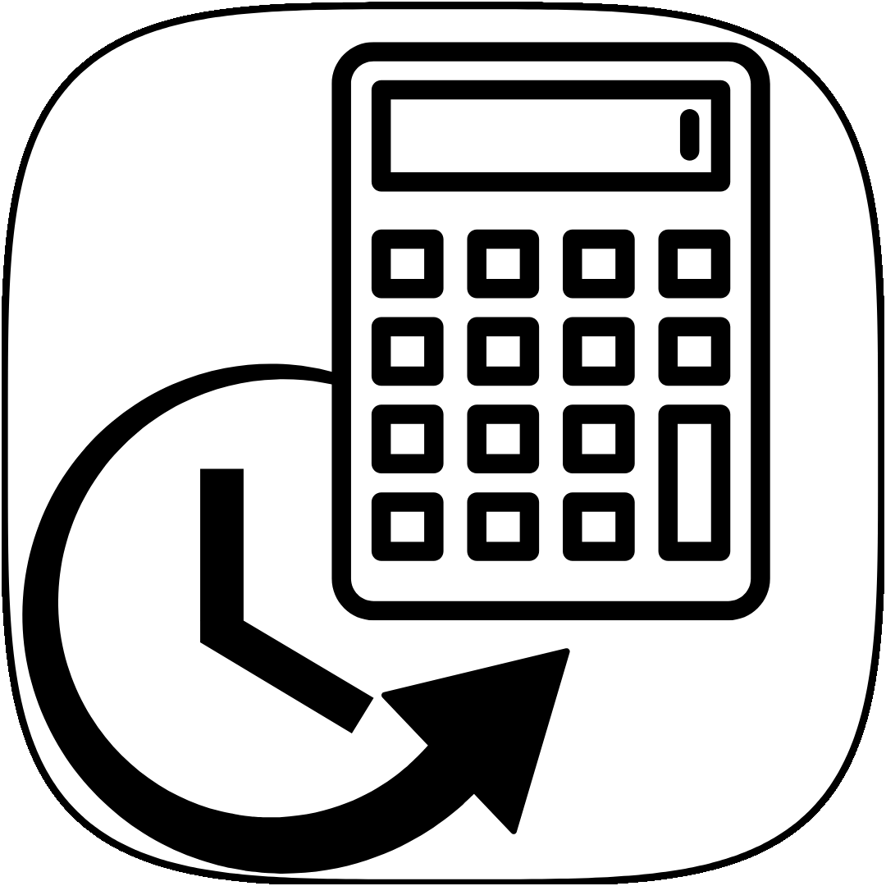
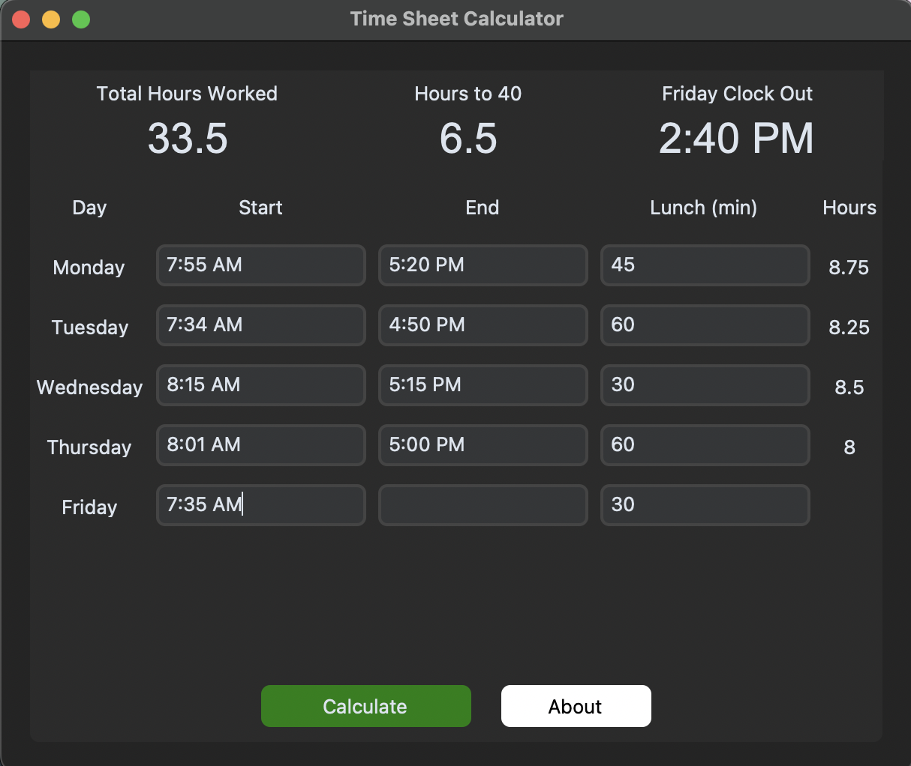
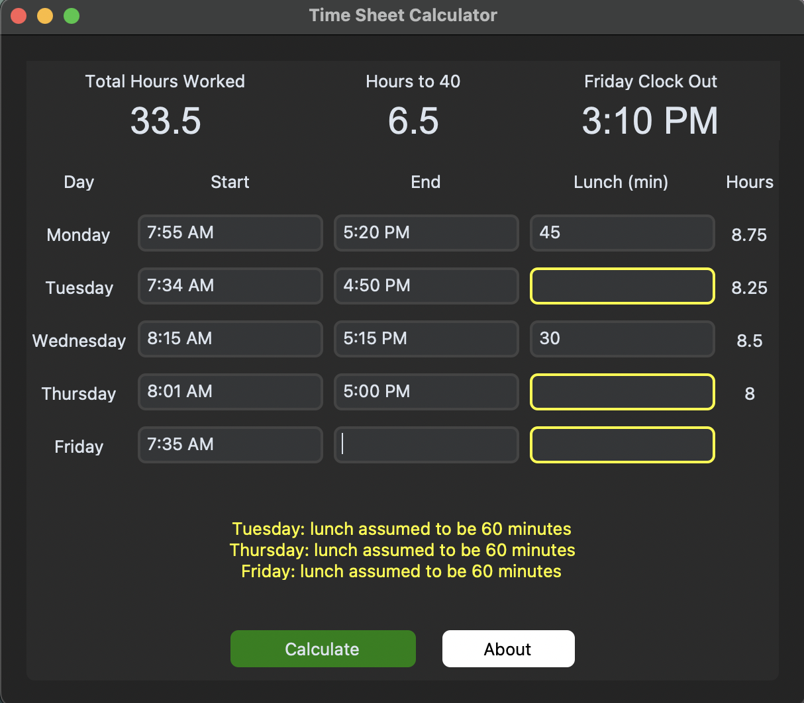
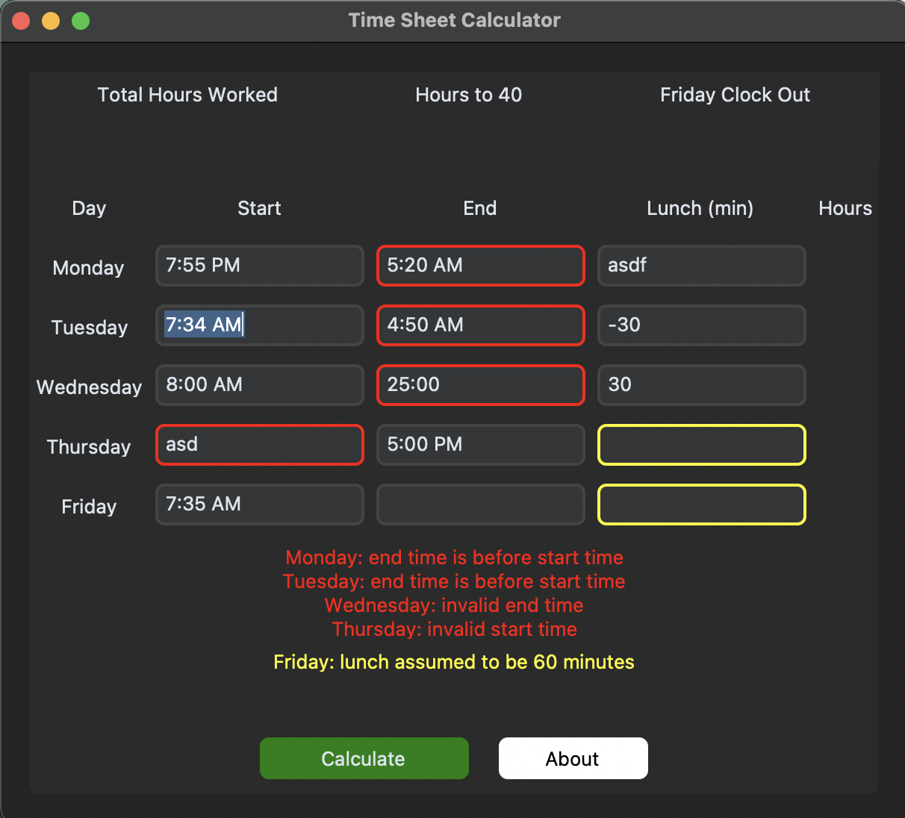
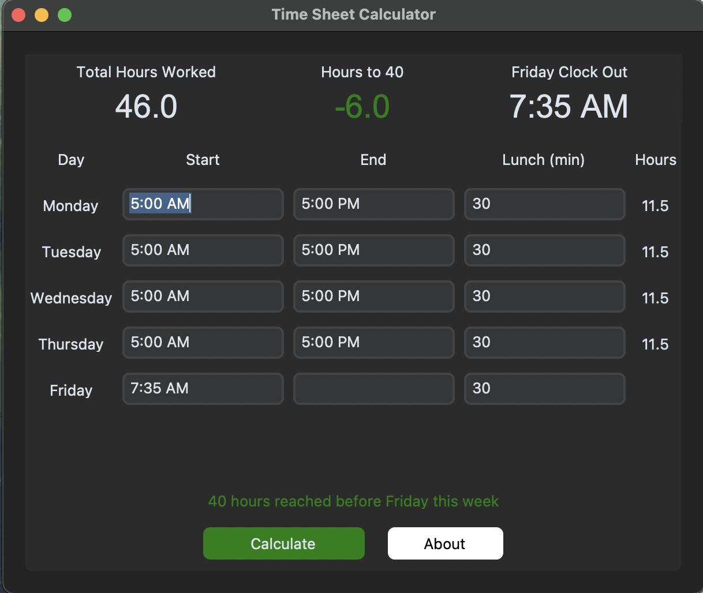
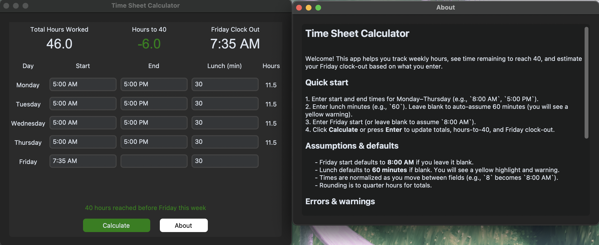

# Time Sheet Calculator

Desktop app to track weekly hours, see time remaining to reach 40, and estimate a Friday clock-out time.

## Time Sheet Calculator Demo

Input your clock in and clock out times for the week and it will auto calculate your clock out time for Friday to get 40 hours.

If no lunch time is given 60 minuts for lunch is assumed with a warning.

If your start and end times for a day are invalid date formats or in the wrong order a red error will let you know.

If you've worked more than 40 hours for a week overtime will be calculated and clock out time on Friday will be the same as your clock in time.

To learn how to use the app a helpful about page is provided inside the app.

## Downloads
- Download the appropriate ZIP:
  - [Download TimeSheetCalculator for Windows](./TimeSheetCalculator_windows_v0.1.0.zip)
  - [Download TimeSheetCalculator for MacOS](./TimeSheetCalculator_macos_v0.1.0.zip)
- Unzip and run:
  - macOS: double-click `TimeSheetCalculator.app` (use right-click → Open on first run if Gatekeeper warns).
  - Windows: double-click `TimeSheetCalculator.exe` (you may need “Run anyway” if SmartScreen prompts).
- Open [ABOUT.md](./src/ABOUT.md) in the ZIP for usage guidance.

## How to Use
- Enter start/end times for Monday–Thursday; add lunch minutes or leave blank to assume 60 minutes.
- Enter Friday start (or leave blank to assume 8:00 AM).
- Click **Calculate** or press **Enter** to update Total Hours Worked, Hours to 40, and Friday clock-out.
- Red = errors (invalid time, end before start, bad lunch). Yellow = assumed lunch.
- See [ABOUT.md](./src/ABOUT.md) for the full usage guide.

## Building from Source
- Prerequisites: Python 3.12+, `uv` installed.
- Setup: `uv sync`
- Run tests with coverage:
  - `uv run pytest --cov=timesheet_service --cov-report=term-missing`
  - `uv run pytest --cov=ui_view_model --cov-report=term-missing tests/test_ui_view_model.py`
  - `uv run pytest --cov=app --cov-report=term-missing tests/test_app_ui.py`
  - Or use the helper script: `./tools/pytest_run_coverage.sh`
- Build (mac): `./tools/build.sh` (produces `.app` bundle wrapping a onefile binary)
- Package (mac): `./tools/package.sh` (produces `TimeSheetCalculator_macos_vX.Y.Z.zip`)
- Build (Windows): `powershell -ExecutionPolicy Bypass -File tools\build.ps1`
- Package (Windows): `powershell -ExecutionPolicy Bypass -File tools\package.ps1`

## Contributing
Contributions are welcome and appreciated. To contribute please fork the repo, create a feature branch, then open a PR.

## Issues
File issues for bugs or feature requests through GitHub.

## License
- GPLv3 — see [LICENSE](./LICENSE.md).
